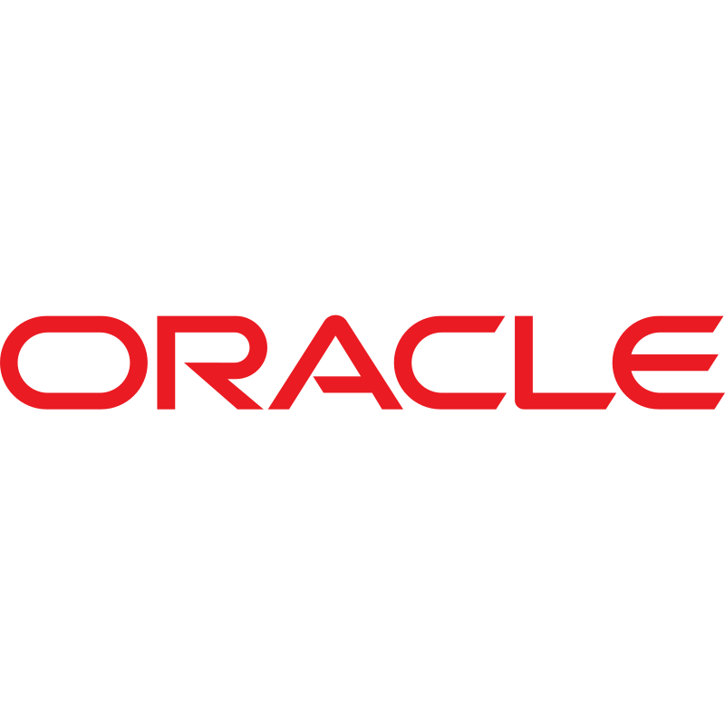

# Oracle Backup Manager для PL/SQL

> Oracle Backup Manager — это программа на Python, предназначенная для упрощения резервного копирования объектов базы данных Oracle, таких как пакеты, процедуры и функции. Она позволяет пользователям эффективно управлять резервными копиями, удалять старые резервные копии на основе заданного порога и извлекать Data Definition Language (DDL) для указанных объектов.

## **Содержание:**

* <a href="#tools">Технологии и инструменты</a>

* <a href="#functions">Основные функции</a>

* <a href="#functions_desc">Описание функций</a>

* <a href="#usage">Использование</a>

* <a href="#interactive">Интерактивное меню</a>

____

## <a name="Технологии и инструменты">**Технологии и инструменты:**</a>

    

  
  
  
  
   

____

## <a name="Основные функции">**Основные функции:**</a>

____
-  *Управление резервным копированием: Поддерживает резервное копирование пакетов, процедур и функций.*
-  *Список объектов: Отображает существующие объекты указанных типов в базе данных.*
-  *Удаление старых резервных копий: Автоматически удаляет резервные копии старше указанного количества дней.*
-  *Гибкий ввод: Позволяет пользователям указывать типы объектов и их имена в интерактивном режиме.*

____

## <a name="Описание функций">**Описание функций:**</a>

____
- *delete_old_folders(base_folder_path, threshold_seconds)
Удаляет папки, которые старше указанного порога, в пределах заданного базового пути.*
- *backup_objects(object_type, backup_path)
Создает резервные копии всех объектов указанного типа (PACKAGE, PROCEDURE, FUNCTION) в соответствующие папки.*
- *backup_specific_object(object_type, object_name, backup_path)
Создает резервную копию конкретного объекта базы данных по его имени и типу.*
- *list_objects(connection, object_type)
Отображает список всех объектов указанного типа в базе данных.*
____

## <a name="Использование">**Использование:**</a>

____
Перед использованием скрипта убедитесь, что у вас установлены необходимые библиотеки. Для работы скрипта требуется библиотека oracledb для подключения к Oracle.

Установите её с помощью pip:

*pip install cx_Oracle*

____
<b>Подключение к базе данных:</b> 

Для работы скрипта необходимо установить соединение с базой данных Oracle. Убедитесь, что у вас есть следующие данные:

Имя пользователя (username)

Пароль (password)

Строка подключения (dsn), например: localhost:1521/orcl

Эти данные будут использоваться для создания соединения с базой данных.
____
<b>Пример запуска из командной строки</b>:

*python oracle_backup_manager.py*

<b>Резервное копирование всех процедур</b>:

*backup_objects(object_type="PROCEDURE", backup_path="backups")*
____

## <a name="Интерактивное меню">**Интерактивное меню:**</a>

___
Если вы не указали параметры object_type и object_name, программа предложит интерактивное меню с выбором действий.

 <b>*Пример меню:*</b>

    

____
